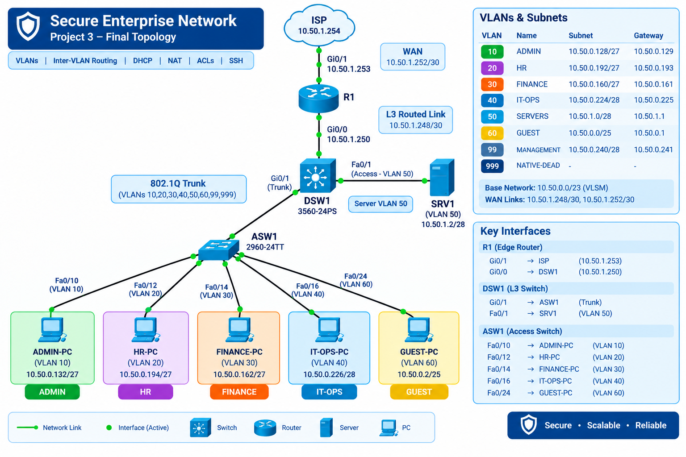
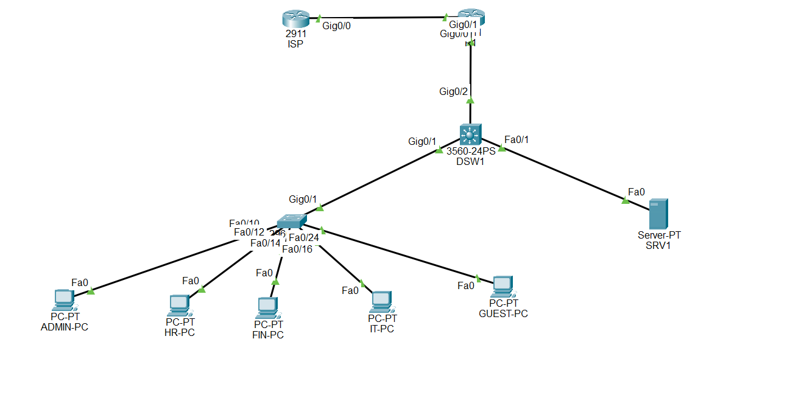

# Secure Enterprise Network

A multi-VLAN enterprise network designed and implemented in Cisco Packet Tracer, focusing on network segmentation, inter-VLAN routing, DHCP, static routing, NAT/PAT, secure management, Layer 2 security, and troubleshooting.

This project was built as a hands-on networking portfolio project while preparing for CCNA and Junior Network Engineer / NOC / Network Support roles.

## Network Topology

### Implementation Evidence

## 📂 Packet Tracer File

The complete Cisco Packet Tracer project file is available here:

👉 [Download / Open Secure Enterprise Network `.pkt` file](packet-tracer/secure-enterprise-network.pkt)

## Project Overview

The network simulates a small enterprise environment with:

- Multiple department VLANs
- Layer 3 switching using a Cisco multilayer switch
- Inter-VLAN routing
- Centralized DHCP using an enterprise server
- Routed connection between the distribution switch and edge router
- NAT/PAT toward a simulated ISP
- SSH-based device management
- Management VLAN
- Layer 2 security controls
- Guest network isolation attempt
- Troubleshooting scenarios
- Verification and documentation

## Network Architecture

    ISP
     |
    R1
     |
    DSW1
     |
    ASW1
     |
    End Devices

    DSW1
     |
    SRV1

### Devices

| Device | Model | Role |
|---|---|---|
| R1 | Cisco 2911 | Edge router, WAN, NAT/PAT |
| DSW1 | Cisco 3560-24PS | Distribution Layer 3 switch |
| ASW1 | Cisco 2960-24TT | Access switch |
| SRV1 | Server | DHCP and DNS |
| ISP | Router | Simulated external network |

## VLAN and IP Addressing Plan

| VLAN | Name | Network | Default Gateway |
|---:|---|---|---|
| 10 | ADMIN | 10.50.0.128/27 | 10.50.0.129 |
| 20 | HR | 10.50.0.192/27 | 10.50.0.193 |
| 30 | FINANCE | 10.50.0.160/27 | 10.50.0.161 |
| 40 | IT-OPS | 10.50.0.224/28 | 10.50.0.225 |
| 50 | SERVERS | 10.50.1.0/28 | 10.50.1.1 |
| 60 | GUEST | 10.50.0.0/25 | 10.50.0.1 |
| 99 | MANAGEMENT | 10.50.0.240/28 | 10.50.0.241 |
| 999 | NATIVE-DEAD | Unused native VLAN | N/A |

The addressing plan was designed from the parent network:

`10.50.0.0/23`

VLSM was used to allocate different subnet sizes according to the expected host requirements of each network.

## Endpoint Addressing

| Device | VLAN | IP Address | Gateway |
|---|---:|---|---|
| ADMIN-PC | 10 | 10.50.0.132/27 | 10.50.0.129 |
| HR-PC | 20 | 10.50.0.194/27 | 10.50.0.193 |
| FINANCE-PC | 30 | 10.50.0.162/27 | 10.50.0.161 |
| IT-OPS-PC | 40 | 10.50.0.226/28 | 10.50.0.225 |
| GUEST-PC | 60 | 10.50.0.2/25 | 10.50.0.1 |
| SRV1 | 50 | 10.50.1.2/28 | 10.50.1.1 |

## Access Port Assignments

### ASW1

| Port | VLAN | Purpose |
|---|---:|---|
| Fa0/10 | 10 | ADMIN |
| Fa0/12 | 20 | HR |
| Fa0/14 | 30 | FINANCE |
| Fa0/16 | 40 | IT-OPS |
| Fa0/24 | 60 | GUEST |
| Gi0/1 | Trunk | Connection to DSW1 |

### DSW1

| Port | VLAN | Purpose |
|---|---:|---|
| Fa0/1 | 50 | SRV1 |
| Gi0/1 | Trunk | Connection to ASW1 |
| Gi0/2 | Routed Port | Connection to R1 |

## Trunk Configuration

The ASW1-to-DSW1 link uses an 802.1Q trunk.

- Native VLAN: 999
- Allowed VLANs: 10, 20, 30, 40, 50, 60, 99, 999

The native VLAN was changed from the default VLAN 1 to VLAN 999 as part of the Layer 2 security design.

## Inter-VLAN Routing

DSW1 performs Layer 3 switching and provides the default gateway for the enterprise VLANs.

SVIs are configured for:

- VLAN 10
- VLAN 20
- VLAN 30
- VLAN 40
- VLAN 50
- VLAN 60
- VLAN 99

This allows communication between different VLANs while applying routing and security policies where appropriate.

## DHCP

SRV1 provides centralized DHCP services.

DHCP pools were configured for:

- ADMIN
- HR
- FINANCE
- IT-OPS
- GUEST

DSW1 uses DHCP relay with `ip helper-address` to forward DHCP requests from the client VLANs to SRV1.

Example architecture:

    Client VLAN
         |
       DSW1
         |
    DHCP Relay
         |
       SRV1
    10.50.1.2

All five DHCP VLANs were individually tested and verified.

## Routing

The DSW1-to-R1 connection is a routed Layer 3 link:

| Device | Interface | IP Address |
|---|---|---|
| DSW1 | Gi0/2 | 10.50.1.249/30 |
| R1 | Gi0/0 | 10.50.1.250/30 |

R1 uses static routes to reach the enterprise VLAN networks.

DSW1 uses a default route toward R1.

R1 connects to the simulated ISP:

| Device | Interface | IP Address |
|---|---|---|
| R1 | Gi0/1 | 10.50.1.253/30 |
| ISP | Gi0/0 | 10.50.1.254/30 |

The ISP contains a return route for the enterprise `10.50.0.0/23` network.

## NAT/PAT

R1 performs Port Address Translation for enterprise clients.

The inside network is represented by the `10.50.0.0/23` address space.

NAT/PAT allows multiple internal clients to use R1's WAN interface address when communicating with the simulated external network.

NAT translations were verified using Cisco IOS operational commands.

> Note: The ISP in this Packet Tracer project is a simulated router and does not represent a real Internet connection. Successful communication with the simulated external network should therefore be interpreted within the scope of the lab.

## Secure Device Management

SSH was configured on R1, DSW1, and ASW1.

Security measures include:

- SSH version 2
- Local user authentication
- RSA key generation
- Privileged administrative account
- VTY access restricted to SSH
- Management VLAN 99
- Management access control list
- Telnet disabled by allowing SSH only on VTY lines
- Password encryption

Management addresses:

| Device | Management IP |
|---|---|
| DSW1 | 10.50.0.241 |
| ASW1 | 10.50.0.242 |

Administrative SSH access was tested from the ADMIN network.

Guest SSH access to the network devices was restricted by the management ACL.

## Layer 2 Security

The project includes several Layer 2 security mechanisms.

### Port Security

Port security was configured on endpoint/server access ports with:

- Maximum MAC addresses
- Sticky MAC learning
- Violation mode: shutdown

### DHCP Snooping

DHCP snooping was enabled on client VLANs.

The ASW1-to-DSW1 trunk was configured as a trusted interface for DHCP traffic.

### Dynamic ARP Inspection

DAI was enabled on the client VLANs with the appropriate trusted trunk configuration.

### PortFast and BPDU Guard

Endpoint access ports were configured with:

- PortFast
- BPDU Guard

This helps protect access ports from unexpected Layer 2 topology changes.

### Unused Ports

Unused switch ports were administratively shut down.

### Native VLAN

VLAN 999 was used as the unused native VLAN on the trunk.

## Guest Network Security

A guest isolation ACL was configured on R1 to restrict Guest VLAN traffic toward internal enterprise networks.

The ACL denies Guest traffic toward the following internal networks:

- Guest
- ADMIN
- HR
- FINANCE
- IT-OPS
- MANAGEMENT
- SERVERS

Traffic not matching those internal destinations is permitted.

### Important Design Limitation

Because DSW1 performs local inter-VLAN routing, traffic between directly connected VLANs can be routed locally without passing through R1.

Therefore, the R1 guest ACL does **not provide complete guest isolation in this specific topology**.

A VACL/SVI-based approach would be more appropriate for enforcing the policy directly at the Layer 3 switching boundary, but the required implementation was limited by Cisco Packet Tracer behavior.

This limitation is intentionally documented rather than presenting the lab as having stronger isolation than it actually demonstrates.

## Troubleshooting Practice

The project includes documented troubleshooting scenarios covering multiple layers of the network.

Examples include:

1. Interface shutdown
2. Wrong VLAN assignment
3. Trunk failure
4. DHCP relay failure
5. Port security failure
6. Native VLAN mismatch
7. Static route failure
8. Default route failure
9. NAT failure
10. Trunk allowed-VLAN failure
11. Server port-security testing

Each troubleshooting report documents the problem, investigation, corrective action, and verification.

See the [`troubleshooting/`](troubleshooting/) directory for the individual incident reports.

## Verification

The completed network was verified through Cisco IOS commands and end-device testing.

Verification included:

- Interface status
- VLAN membership
- Trunk status
- SVI status
- Inter-VLAN connectivity
- DHCP address assignment
- DHCP relay
- Routing table
- Static routes
- Default routes
- NAT translations
- SSH access
- Management ACL behavior
- Port security
- DHCP snooping
- Dynamic ARP Inspection
- WAN connectivity
- Simulated external connectivity

Representative Cisco verification commands include:

    show ip interface brief
    show vlan brief
    show interfaces trunk
    show ip route
    show ip ssh
    show access-lists
    show port-security
    show port-security address
    show ip nat translations
    show ip nat statistics

## Project Structure

    Secure-enterprise-network/
    │
    ├── documentation/
    │   ├── addressing-plan.md
    │   ├── dhcp-and-routing.md
    │   ├── security.md
    │   └── verification.md
    │
    ├── packet-tracer/
    │   └── secure-enterprise-network.pkt
    │
    ├── topology/
    │   ├── topology.png
    │   └── packet-tracer-screenshot.png
    │
    └── troubleshooting/
        ├── README.md
        ├── 01-interface-shutdown.md
        ├── 02-wrong-vlan.md
        ├── 03-trunk-failure.md
        ├── 04-dhcp-relay-failure.md
        ├── 05-port-security-failure.md
        ├── 06-native-vlan-mismatch.md
        ├── 07-static-route-failure.md
        ├── 08-default-route-failure.md
        ├── 09-nat-failure.md
        ├── 10-trunk-allowed-vlan.md
        └── 11-server-port-security-test.md

## Skills Demonstrated

### Networking

- IPv4 addressing
- VLSM
- Subnetting
- VLAN segmentation
- 802.1Q trunking
- Inter-VLAN routing
- Layer 3 switching
- Static routing
- Default routing
- DHCP
- DHCP relay
- NAT/PAT
- WAN connectivity

### Security

- SSH
- Management ACLs
- Port security
- Sticky MAC
- DHCP snooping
- Dynamic ARP Inspection
- PortFast
- BPDU Guard
- Native VLAN security
- Unused-port shutdown
- Guest network access control

### Troubleshooting

- Layer 1/2/3 fault isolation
- Interface troubleshooting
- VLAN troubleshooting
- Trunk troubleshooting
- DHCP troubleshooting
- Routing troubleshooting
- NAT troubleshooting
- Security feature troubleshooting
- Verification using Cisco IOS commands

### Documentation

- Network addressing plan
- Security documentation
- DHCP and routing documentation
- Verification documentation
- Incident-based troubleshooting reports
- Network topology documentation

## Tools Used

- Cisco Packet Tracer
- Cisco IOS CLI
- GitHub
- Markdown

## Project Limitations

This project was implemented in Cisco Packet Tracer for learning and portfolio purposes.

Packet Tracer does not reproduce every behavior of real Cisco hardware. Some security features and troubleshooting behaviors may therefore differ from production environments.

The ISP is also a simulated router rather than a real Internet service provider.

The Guest isolation design limitation described above is intentionally documented as part of the project's technical analysis.

## Security Note

Credentials used during the lab should be treated as lab-only credentials.

No production credentials, secrets, or sensitive organizational information should be stored in this repository.

## Project Status

Completed and documented.

The network configuration, security controls, routing, DHCP, NAT/PAT, troubleshooting scenarios, verification results, topology, and final Packet Tracer project file are included in this repository.
